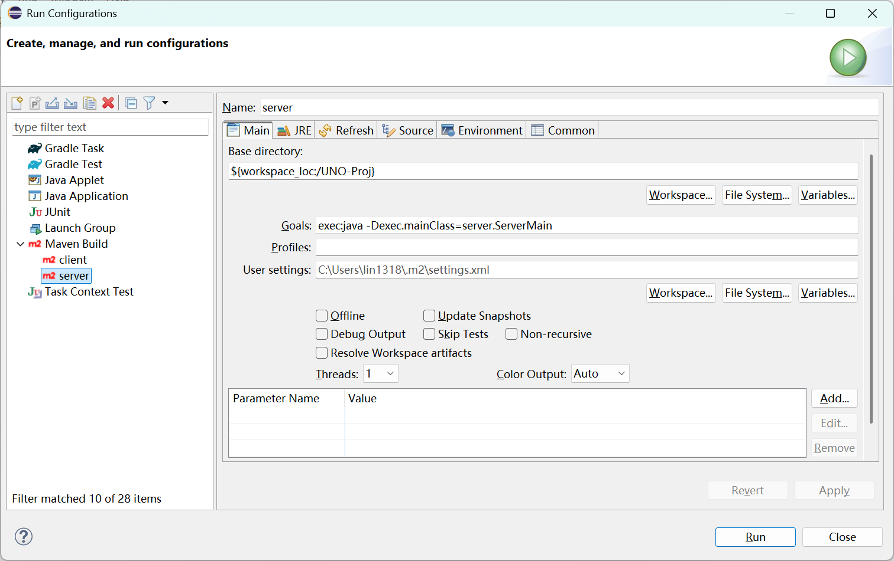
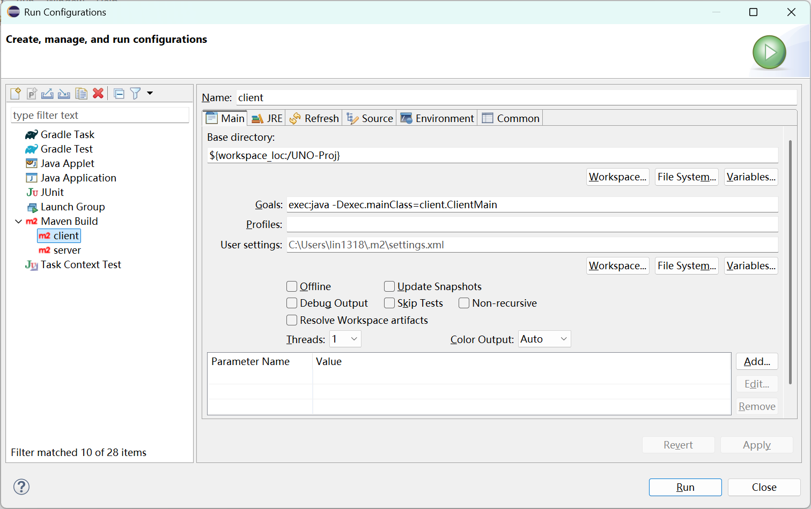

# UNO Project

## Authors
- Zhuchang Gu(zg2923@nyu.edu)
- Yangzhou Lin(yl13853@nyu.edu)

## Requirements

- Java 17 or newer
- Maven 3.9+

## Build

```bash
mvn compile
```

The project now uses SQLite for persistent player profiles and match history. The database file is created at `data/uno.db`.

## Start the server

Default port:

```bash
mvn exec:java -Dexec.mainClass=server.ServerMain
```

Or use the helper script:

```bash
./run-server.sh
```

Or use Eclipse Run Configurations


Custom port:

```bash
mvn exec:java -Dexec.mainClass=server.ServerMain -Dexec.args="5051"
```

Or:

```bash
./run-server.sh 5051
```

The project defaults to port `5050` because port `5000` is commonly occupied by macOS system services.

## Start the client

Open a new terminal window for each client:

```bash
mvn exec:java -Dexec.mainClass=client.ClientMain
```

Or:

```bash
./run-client.sh
```
Or use Eclipse run configurations:


In the lobby UI:

1. Enter `127.0.0.1`
2. Enter port `5050` unless you started the server on another port
3. Enter a username
4. Client A creates a room
5. Either let Client B join the same room ID, or have the host click `Add Bot`
6. When the room reaches its selected size, the host clicks `Start Game`
7. During play, `Group Draw` and `Triple Peek` only become usable when you have no ordinary playable card and are otherwise about to draw
8. `Group Draw` and `Triple Peek` now exist in four color variants: red, yellow, green, and blue
9. If the host starts another game after `Game Over`, the same room can begin a new round without reconnecting
10. After a match ends, the server writes match history and refreshes each human player's stats in the UI

## Advanced Concepts Used

### 1. GUI Programming
We developed a graphical Java client using Swing to provide an interactive game interface. 
Players can view cards, select actions through buttons, and receive real-time game updates through the GUI instead of a command-line interface.

### 2. Networking and Client-Server Architecture
The project uses a client-server architecture that allows multiple players to connect to the same UNO game room through network sockets. 
The server is responsible for synchronizing the game state, handling player requests, and broadcasting updates to all connected clients.

### 3. Multithreading
The server is implemented as a multithreaded application so it can handle multiple client connections concurrently. 
Each client connection runs on a separate thread, allowing multiple players to interact with the game simultaneously.

### 4. Database Persistence with SQLite
The project uses SQLite to persist player accounts, match history, and game statistics. 
SQLite provides lightweight local database storage and allows the system to save and retrieve data across different game sessions using SQL queries and JDBC.

## Notes

- If the server says `Port XXXX is already in use`, start it with another port and use the same port in both clients.
- Some macOS Swing runs print `TSM` or `IMKCFRunLoopWakeUpReliable` lines in the terminal. Those are system input-method logs and are not the actual game error.
